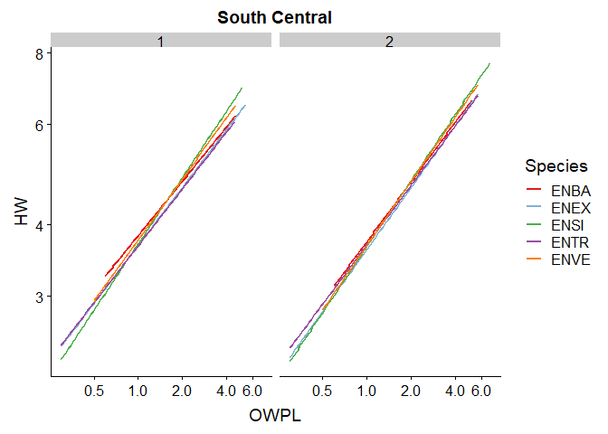
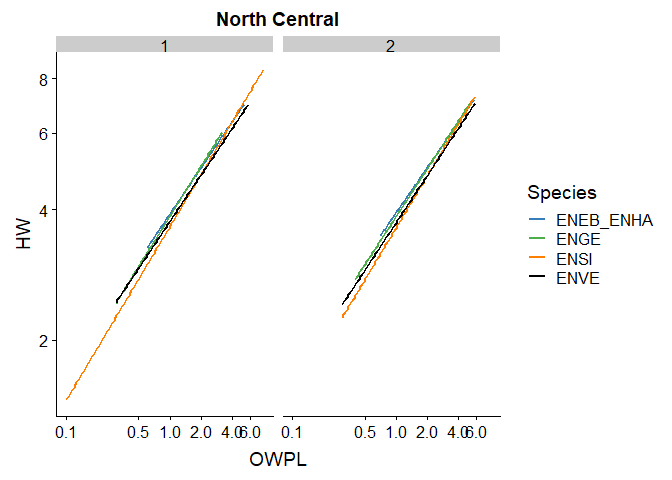
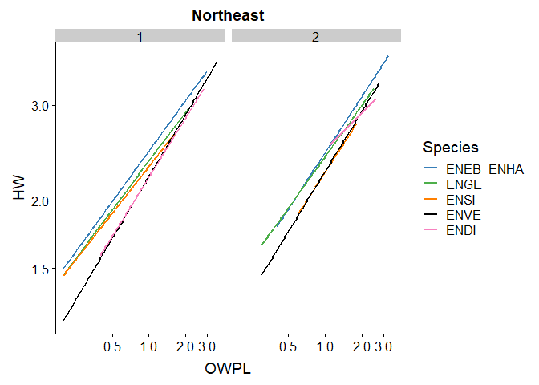

Damselfly Allometry
================

## Data Preparation

All data prep steps happen in the DataSteps.R file. If you have any
questions it’s pretty well annotated.

I dropped species if we did not capture are least 10 individuals at more
than 2 sites.

``` r
source('DataSteps.R')
```

There are a few different ways you could analyze the data. Here’s what
I’ve tried so far.

## Option 1: Phylogenetic conservatism analysis

Initially it seemed like a good idea to control for relatedness and/or
to look at whether more closely related species had similar growth
responses. Unfortunately, we don’t have enough species to pull that off
(either within a region or shared across regions).

## Option 2: Analyze all data in 1 model

One way to go about this is to include all the lakes in one model and to
include region as a covariate. The downside to this approach is only 3
of the 7 species with that meant minimum observation threshold were
found across the midwest and in New England.

|             | NorthCentral | SouthCentral |  NE |
| ----------- | -----------: | -----------: | --: |
| ENBA        |            0 |         1340 |   0 |
| ENCI        |            0 |            3 |   0 |
| ENEX        |            0 |         1566 |  35 |
| ENEB\_ENHA  |          468 |            0 | 858 |
| ENGE        |          794 |           76 | 346 |
| ENSI        |         1462 |         3105 | 100 |
| ENTR        |          148 |         2763 |   1 |
| ENVE        |         1391 |         2356 | 507 |
| ENVERN      |           56 |            0 |  66 |
| Argia       |            0 |            0 |   0 |
| Dragonflies |            0 |            0 |   0 |
| ENAS        |            0 |            0 |   2 |
| ENDI        |            0 |            0 | 271 |
| ENMI        |            0 |            0 |  30 |
| ENPI        |            0 |            0 |  57 |
| Ischnura    |            0 |            0 |   0 |
| Lestes      |            0 |            0 |   0 |
| Nehalennia  |            0 |            0 |   0 |

## Option 3: Analyze each region separately

Another way to approach the problem is to model each region (south
central, north central, and northeast) separately. The advantage here is
that we can include all species. This approach focusses more on growth
pattern differnces among species and less on differences between
regions.

### New England

|                         | ENEB\_ENHA | ENGE | ENSI | ENVE | ENDI |
| ----------------------- | ---------: | ---: | ---: | ---: | ---: |
| 4A Pond                 |         57 |   17 |    0 |    0 |    0 |
| Beaver Pond             |         19 |    3 |    0 |   33 |   80 |
| Berry Pond              |          0 |    4 |    0 |    2 |    6 |
| Bresses Pond, VT        |         71 |   13 |    0 |    2 |    0 |
| Burr Pond, VT           |          1 |    2 |    0 |    4 |    0 |
| Colby Pond, VT          |          2 |    0 |    0 |    0 |    0 |
| Colton Pond, VT         |         63 |   10 |    0 |   19 |    0 |
| Crooked Pond            |          2 |    0 |    0 |   23 |   14 |
| Day Pond                |         18 |    6 |    0 |   14 |    0 |
| Dewey Pond, VT          |          0 |    7 |   25 |   25 |    0 |
| Ewell Pond, VT          |          1 |    0 |    0 |    3 |    0 |
| Fosters Pond, VT        |          4 |    0 |    0 |    0 |    0 |
| Fresses Pond            |          0 |    5 |    0 |    3 |    0 |
| George’s Pond           |          2 |   19 |    0 |    3 |    0 |
| Hoit Rd. Marsh          |         21 |    7 |    0 |   48 |   15 |
| Hough Pond, VT          |          8 |    2 |    0 |    0 |    0 |
| Keiser Pond, VT         |          0 |    0 |    0 |    2 |    0 |
| Kent Pond, VT           |          0 |    0 |    0 |   10 |    0 |
| Lake Ninevah, VT        |         39 |    6 |    0 |    8 |    0 |
| Lake Tarleton, NH       |          4 |    2 |    0 |    0 |    0 |
| Lake Winnepocket        |          1 |    2 |    0 |   46 |   23 |
| Lower Baker Pond I, NH  |          2 |    0 |    7 |   35 |    0 |
| Lower Baker Pond II, NH |         13 |    0 |   19 |   17 |    0 |
| Lower Symes Pond, VT    |         39 |    1 |    0 |    9 |    0 |
| Martin’s Pond, VT       |        143 |    0 |    0 |    0 |    0 |
| May Pond                |         11 |    0 |    0 |    0 |    0 |
| McDaniel’s Marsh        |         48 |    4 |    0 |   15 |    0 |
| Mill Pond               |          1 |    1 |    0 |    0 |    0 |
| Pinnacle Pond, VT       |         22 |    6 |    0 |    0 |    0 |
| Post Pond, NH           |          4 |   11 |   18 |   53 |    0 |
| Roach Pond, VT          |         18 |    2 |    0 |    8 |    0 |
| Rollins Pond            |          4 |    0 |    0 |    8 |    4 |
| Russell Pond            |        142 |   98 |    0 |    1 |    0 |
| Rye Pond                |         18 |    1 |    0 |    3 |    5 |
| Sanborn Pond            |          3 |   29 |    0 |   18 |    5 |
| Spectacle Pond          |          9 |    3 |    0 |    2 |    0 |
| Spruce Pond             |          0 |    1 |    0 |    3 |   54 |
| Stocker Pond            |          5 |   10 |    0 |   32 |    0 |
| Ticklenaked Pond, VT    |         33 |    4 |    8 |    5 |    0 |
| Walker Pond             |          6 |    9 |    0 |   19 |   65 |

### North Central

|                | ENEB\_ENHA | ENGE | ENSI | ENVE |
| -------------- | ---------: | ---: | ---: | ---: |
| ClearwaterLake |          0 |    0 |    0 |   23 |
| CodyLake       |          0 |    0 |   41 |    0 |
| DiamondLake    |         23 |   25 |  440 |  234 |
| GreenLake      |          0 |    0 |    0 |  210 |
| LakeNopawan    |          0 |    0 |    0 |   28 |
| LoonLake       |        387 |    0 |    0 |    0 |
| LuraLake       |          0 |    0 |  221 |    0 |
| MargaretLake   |          0 |    0 |    0 |   57 |
| MissionLake    |          0 |    0 |    0 |   91 |
| MollieLake     |          0 |    0 |    0 |   79 |
| MudLake        |          0 |  282 |  120 |    0 |
| PalmatierLake  |          0 |  242 |   59 |  279 |
| PatrickLake    |          0 |    0 |   26 |    0 |
| PickerelLake   |         56 |    0 |    0 |   83 |
| SpringLake     |          0 |    0 |   39 |    0 |
| SpringLakeEast |          0 |    0 |   36 |  138 |
| SpurzemLake    |          0 |  206 |  394 |   86 |
| WiscobeeLake   |          0 |   23 |    0 |   55 |

### South Central

|                   | ENBA | ENEX | ENSI | ENTR | ENVE |
| ----------------- | ---: | ---: | ---: | ---: | ---: |
| BobbKiddLake      |   69 |    8 |  107 |   20 |  139 |
| BoonevilleLake    |    0 |   23 |    0 |    7 |   13 |
| CharlestonLake    |    3 |   61 |  208 |  134 |  189 |
| CoveLake          |    0 |    3 |    0 |    1 |   16 |
| CrystalLake       |   11 |   18 |   19 |    1 |    0 |
| DarbyLake         |    2 |  100 |  156 |  564 |  120 |
| EngineerLake      |    0 |   79 |   22 |  233 |  132 |
| GreenwoodLake     |    1 |   11 |  184 |  153 |   84 |
| HorseheadLake     |    2 |  108 |   36 |  170 |   75 |
| LakeFayetteville  |  114 |  512 |  748 |  127 |  283 |
| LakeLeatherwood   |  161 |   95 |   33 |  370 |   18 |
| LakeLincoln       |  349 |  260 |  736 |  395 |  742 |
| LakePrairieGrove  |   84 |    6 |  141 |   44 |   71 |
| LakeSequoyah      |    0 |   11 |   51 |  195 |    4 |
| LakeWedington     |   16 |  138 |   21 |  121 |   31 |
| LakeWilson        |  450 |   12 |   27 |   87 |   20 |
| LockAndDamPond    |    0 |    2 |  478 |   39 |   21 |
| OzarkCityLake     |    0 |   43 |    5 |   28 |  113 |
| ParisReservoir    |    0 |   14 |   26 |   50 |  273 |
| SiloamSpringsLake |   78 |   60 |   96 |   19 |   10 |

### Step 1: Look at relationship between head width (HW) and outer wing pad length (OWPL)

If correlation perfect = isometry, weak = allometry

I used a log \~ log model becuase a lot of the literature of growth
relationships suggests a power relationship. But that migth not be
supported here. Something to think about.

Model: log(HW) \~ Species \* log(OWPL) + Sampling Round + (OWPL|Lake)

<table style="text-align:center">

<tr>

<td colspan="4" style="border-bottom: 1px solid black">

</td>

</tr>

<tr>

<td style="text-align:left">

</td>

<td colspan="3">

<em>Dependent variable:</em>

</td>

</tr>

<tr>

<td>

</td>

<td colspan="3" style="border-bottom: 1px solid black">

</td>

</tr>

<tr>

<td style="text-align:left">

</td>

<td colspan="3">

log(HW)

</td>

</tr>

<tr>

<td style="text-align:left">

</td>

<td>

Northeast

</td>

<td>

North Central

</td>

<td>

South Central

</td>

</tr>

<tr>

<td colspan="4" style="border-bottom: 1px solid black">

</td>

</tr>

<tr>

<td style="text-align:left">

Constant

</td>

<td>

0.898<sup>\*\*\*</sup> (0.006)

</td>

<td>

1.372<sup>\*\*\*</sup> (0.011)

</td>

<td>

1.329<sup>\*\*\*</sup> (0.005)

</td>

</tr>

<tr>

<td style="text-align:left">

SpeciesENGE

</td>

<td>

\-0.030<sup>\*\*\*</sup> (0.009)

</td>

<td>

\-0.027<sup>\*\*\*</sup> (0.009)

</td>

<td>

</td>

</tr>

<tr>

<td style="text-align:left">

SpeciesENEX

</td>

<td>

</td>

<td>

</td>

<td>

\-0.016<sup>\*\*\*</sup> (0.005)

</td>

</tr>

<tr>

<td style="text-align:left">

SpeciesENSI

</td>

<td>

\-0.078<sup>\*\*\*</sup> (0.016)

</td>

<td>

\-0.074<sup>\*\*\*</sup> (0.009)

</td>

<td>

\-0.012<sup>\*\*</sup> (0.005)

</td>

</tr>

<tr>

<td style="text-align:left">

SpeciesENTR

</td>

<td>

</td>

<td>

</td>

<td>

\-0.019<sup>\*\*\*</sup> (0.005)

</td>

</tr>

<tr>

<td style="text-align:left">

SpeciesENVE

</td>

<td>

\-0.087<sup>\*\*\*</sup> (0.008)

</td>

<td>

\-0.050<sup>\*\*\*</sup> (0.009)

</td>

<td>

\-0.007 (0.005)

</td>

</tr>

<tr>

<td style="text-align:left">

SpeciesENDI

</td>

<td>

\-0.081<sup>\*\*\*</sup> (0.015)

</td>

<td>

</td>

<td>

</td>

</tr>

<tr>

<td style="text-align:left">

log(OWPL)

</td>

<td>

0.330<sup>\*\*\*</sup> (0.010)

</td>

<td>

0.346<sup>\*\*\*</sup> (0.009)

</td>

<td>

0.341<sup>\*\*\*</sup> (0.005)

</td>

</tr>

<tr>

<td style="text-align:left">

as.factor(Sampling.Round)2

</td>

<td>

0.006 (0.005)

</td>

<td>

\-0.004<sup>\*\*\*</sup> (0.001)

</td>

<td>

\-0.005<sup>\*\*\*</sup> (0.001)

</td>

</tr>

<tr>

<td style="text-align:left">

SpeciesENGE:log(OWPL)

</td>

<td>

\-0.009 (0.015)

</td>

<td>

0.027<sup>\*\*\*</sup> (0.008)

</td>

<td>

</td>

</tr>

<tr>

<td style="text-align:left">

SpeciesENEX:log(OWPL)

</td>

<td>

</td>

<td>

</td>

<td>

\-0.001 (0.005)

</td>

</tr>

<tr>

<td style="text-align:left">

SpeciesENSI:log(OWPL)

</td>

<td>

\-0.038 (0.027)

</td>

<td>

0.049<sup>\*\*\*</sup> (0.008)

</td>

<td>

0.033<sup>\*\*\*</sup> (0.005)

</td>

</tr>

<tr>

<td style="text-align:left">

SpeciesENTR:log(OWPL)

</td>

<td>

</td>

<td>

</td>

<td>

0.002 (0.005)

</td>

</tr>

<tr>

<td style="text-align:left">

SpeciesENVE:log(OWPL)

</td>

<td>

0.036<sup>\*\*\*</sup> (0.013)

</td>

<td>

0.015<sup>\*</sup> (0.008)

</td>

<td>

0.020<sup>\*\*\*</sup> (0.005)

</td>

</tr>

<tr>

<td style="text-align:left">

SpeciesENDI:log(OWPL)

</td>

<td>

\-0.001 (0.023)

</td>

<td>

</td>

<td>

</td>

</tr>

<tr>

<td colspan="4" style="border-bottom: 1px solid black">

</td>

</tr>

<tr>

<td style="text-align:left">

Observations

</td>

<td>

1,940

</td>

<td>

3,983

</td>

<td>

11,110

</td>

</tr>

<tr>

<td style="text-align:left">

Akaike Inf. Crit.

</td>

<td>

\-3,442.988

</td>

<td>

\-14,127.620

</td>

<td>

\-31,505.360

</td>

</tr>

<tr>

<td style="text-align:left">

Bayesian Inf. Crit.

</td>

<td>

\-3,359.431

</td>

<td>

\-14,045.850

</td>

<td>

\-31,395.620

</td>

</tr>

<tr>

<td colspan="4" style="border-bottom: 1px solid black">

</td>

</tr>

<tr>

<td style="text-align:left">

<em>Note:</em>

</td>

<td colspan="3" style="text-align:right">

<sup>*</sup>p\<0.1; <sup>**</sup>p\<0.05;
<sup>***</sup>p\<0.01

</td>

</tr>

</table>

<!-- --><!-- --><!-- -->
